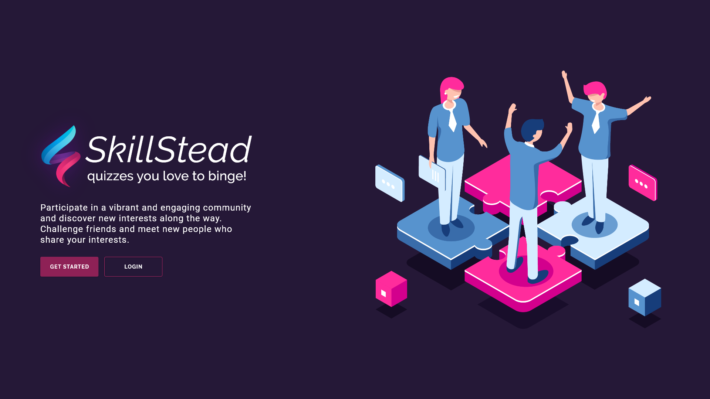
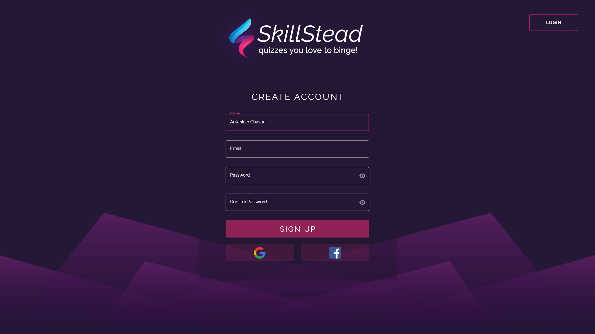
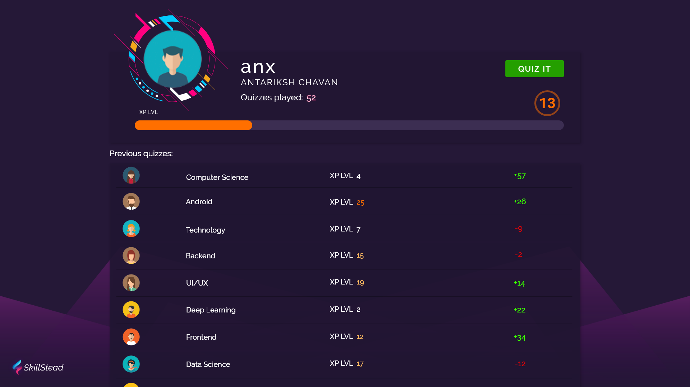

<h1 align="center">SkillStead</h1>

<p align="center">
  <a href="https://angular.io/guide/releases"></a>
  <a href="http://www.apache.org/licenses/LICENSE-2.0"></a>
</p>

<p align="center">
SkillStead is a multiplayer realtime quiz developed with Socket.IO.<br>This repository contains the Frontend code for SkillStead, built using Angular 2 consuming the RESTful API and Socket connection provided by the <a href="https://github.com/antarikshc/SkillStead-nodejs">backend</a>.
</p>
</br>

<p align="center">

</p>


## Development server

Run `ng serve` for a dev server. Navigate to `http://localhost:4200/`. The app will automatically reload if you change any of the source files.

## Build

Run `ng build` to build the project. The build artifacts will be stored in the `dist/` directory. Use the `--prod` flag for a production build.

<p align="center">


</p>

# License
```xml
Designed and developed by antarikshc (Antariksh Chavan)

Licensed under the Apache License, Version 2.0 (the "License");
you may not use this file except in compliance with the License.
You may obtain a copy of the License at

   http://www.apache.org/licenses/LICENSE-2.0

Unless required by applicable law or agreed to in writing, software
distributed under the License is distributed on an "AS IS" BASIS,
WITHOUT WARRANTIES OR CONDITIONS OF ANY KIND, either express or implied.
See the License for the specific language governing permissions and
limitations under the License.
```
